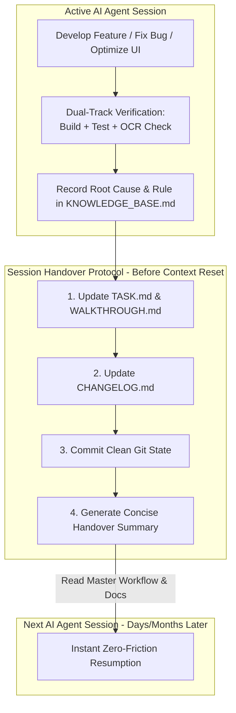
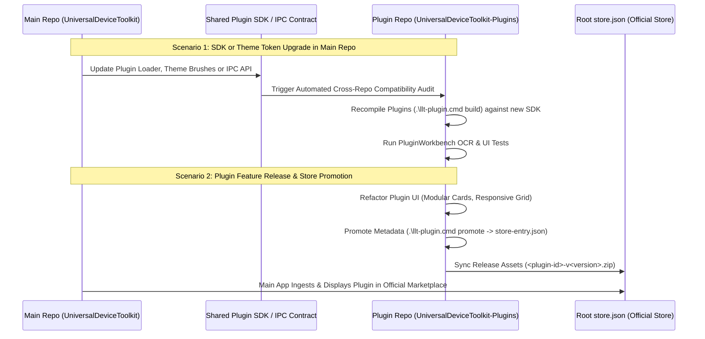
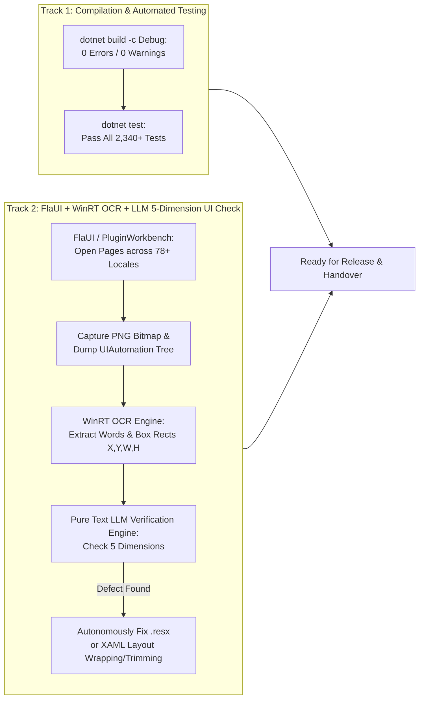

# Autonomous Maintenance, Cross-Repository Interaction & Project Evolution Workflow

This document establishes the authoritative, long-term (decade-scale) autonomous workflow for AI agents and human maintainers managing **Universal Device Toolkit** (Main Repository) and **UniversalDeviceToolkit-Plugins** (Plugin Repository). 

By standardising **Cross-Repository Synchronization**, **Session Handover & Knowledge Accumulation**, **Feature Evolution**, and **Dual-Track Verification**, this workflow ensures that any AI agent can step into the project at any point in time, instantly grasp the full context, and execute flawless maintenance and development.

---

## 🚀 1. The One-Prompt Trigger (一键触发指令)

To initiate autonomous maintenance, feature addition, bug fixing, or cross-repository synchronization, the user only needs to provide the following instruction to any AI agent (Claude Code, Cursor, Agent CLI):

> **"Read `D:\EliuaK_Csy\Working-Paper\My-Program\UniversalDeviceToolkit\AUTONOMOUS_MAINTENANCE_AND_EVOLUTION_WORKFLOW.md` (or the plugin repo equivalent) and execute autonomous project maintenance, cross-repository synchronization, feature evolution, and knowledge accumulation."**

---

## ⏳ 2. Decade-Scale Maintenance, Handover & Knowledge Accumulation (长期运行、交接与经验累积)

Long-term software maintenance over weeks, months, or years fails when institutional knowledge is lost between developer transitions or AI context window resets. To guarantee permanent continuity, all work MUST adhere to the **Living Ledger & Handover Protocol**:

### A. The Living Knowledge Ledger (`KNOWLEDGE_BASE.md`)
Every time an AI agent solves a complex bug, discovers a Windows OS quirk (e.g., WMI ACPI deadlocks in Win11 24H2, FlaUI DPI scaling behavior, or satellite assembly loading tricks), or optimizes an architectural bottleneck, it MUST append a structured entry to `KNOWLEDGE_BASE.md` (located in both repository roots):
- **Timestamp & Version**: When and under what .NET/OS version the lesson was learned.
- **Symptom / Pitfall**: What failed (e.g., `"InvalidOperationException during plugin download callback"`).
- **Root Cause**: Why it failed (e.g., `"ConfigureAwait(false) stripped WPF SynchronizationContext"`).
- **Enforced Rule**: What mandatory constraint prevents recursion (e.g., `"Always use Dispatcher.InvokeAsync()"`).

### B. The 4-Step Handover Protocol (交接四步法)
When an AI agent finishes a task or approaches its context window / token limit, it must NEVER simply terminate. It must execute the mandatory Handover Protocol:
1. **Update Task & Walkthrough Ledgers**: Mark completed items in `TASK.md` and document verification evidence (screenshots, test logs) in `WALKTHROUGH.md`.
2. **Update Release Changelogs**: Append user-visible changes to `CHANGELOG.md` in the root and relevant plugin directories.
3. **Verify Git Cleanliness**: Ensure no half-written, uncompilable files remain. Run `dotnet build` to confirm a 0-error state.
4. **Emit Handover Summary**: Output a structured summary detailing: *What was just completed*, *What open tasks remain*, and *What specific file paths the next agent should read first*.

---

## 🔄 3. Cross-Repository Interaction & SDK Synchronization (主仓库与插件仓库协同交互)

The **Main Repository (`UniversalDeviceToolkit`)** and **Plugin Repository (`UniversalDeviceToolkit-Plugins`)** are intrinsically linked. The Main Repo defines the host loader, IPC contracts, SDK (`UniversalDeviceToolkit.Lib.Plugins`), and UI theme brushes. The Plugin Repo builds extensions that consume these contracts.

### A. Cross-Repository Synchronization Rules
1. **SDK Compatibility Audits**: Whenever `UniversalDeviceToolkit.Lib.Plugins` or WPF theme resources change in the Main Repo, the maintainer/agent must immediately run a cross-repo verification: navigate to `UniversalDeviceToolkit-Plugins`, execute `.\llt-plugin.cmd build`, and verify that all plugins compile cleanly against the updated contract.
2. **Authoring vs. Runtime Manifests**: In the Plugin Repo, `plugin.manifest.json` is the authoritative source of truth for plugin identity, tags, languages, and store metadata. The tool `.\llt-plugin.cmd promote` synchronizes this to `store-entry.json` and generates `plugin.json` for host runtime compatibility.
3. **Marketplace Release Ingestion**: When stable plugin ZIP packages are released, the Main Repo's marketplace generator (`generate-store`) aggregates all `store-entry.json` files and assets into the master root `store.json` consumed by end users.

---

## 🛠️ 4. Feature Evolution & Development Loop (新功能开发与进阶闭环)

When adding new features (e.g., a new hardware sensor monitor, an AI overclocking assistant, or a new network acceleration mode), development must follow our **4 Immutable Engineering Pillars**:

### A. The 4 Engineering Pillars
1. **WPF Thread Safety & Zero `.ConfigureAwait(false)`**: Never strip the UI synchronization context. Always guard background-triggered UI repaints via `Dispatcher.CheckAccess()` and `Dispatcher.InvokeAsync()`.
2. **WMI & Remote Desktop Deadlock Protection**: All WMI queries and administrative process executions (`netsh`, `sc`) must use asynchronous wrappers with strict 2,500ms–3,000ms timeouts and cancellation tokens.
3. **Zero-Spam Polling & I/O Efficiency**: High-frequency monitoring loops (500ms–2000ms) must never serialize JSON or emit disk trace logs on every tick.
4. **Modular UI & Design Token Binding**: All interfaces (Main App and Plugins) must use rounded cards (`CornerRadius="8"`), responsive layouts (`Grid` star-sizing, `WrapPanel`), and 100% host theme brush binding (`ControlFillColorDefaultBrush`). Never write monolithic 600-line stack panels or hardcoded hex colors!

### B. New Feature Implementation Workflow
1. **Requirements & Architecture Check**: Define the feature scope in `TASK.md`. Verify that no synchronous WMI or blocking network I/O is introduced.
2. **Resource & Localization Extraction**: Add all user-facing strings directly to `Resource.resx` using numbered placeholders (`{0}`, `{1}`)—never string concatenation!
3. **Code & UI Construction**: Implement clean C# 12 / .NET 10 code (primary constructors, file-scoped namespaces, `#nullable enable`) and modular XAML.
4. **Compile & Unit Test**: Execute `dotnet build` (ensuring 0 errors and 0 warnings) and run unit tests.

---

## 🔍 5. Dual-Track Verification & OCR Quality Assurance (双轨质检与 OCR 纯文本大模型验证)

Every code modification or feature addition must pass our **Dual-Track Verification Pipeline** before being committed or promoted:

### The 5-Dimension OCR Verification Rules
When evaluating FlaUI screenshots and WinRT OCR bounding boxes against UIAutomation control rectangles, the Pure Text LLM enforces:
1. **Untranslated Detection**: Flagging English fallback text in non-English locales (`zh-Hans`, `de`, `ja`, `ru`).
2. **Mojibake & Encoding Corruption**: Flagging corrupted UTF-8/UTF-16 characters or replacement boxes (`□`).
3. **Broken Placeholders**: Flagging unreplaced format specifiers (`{0}`, `{voltage:F2}`) or raw binding tags.
4. **Layout Truncation & Box Overflow**: Comparing OCR text width against container width. If text ends in ellipses (`...`) or overflows button borders, autonomously modify XAML to enable `TextWrapping="Wrap"`, `TextTrimming="CharacterEllipsis"`, or dynamic `MinWidth`.
5. **Technical Domain Semantics**: Verifying accurate hardware terminology ("Fan Curve", "MUX Switch", "Winsock Reset").

---

## 📈 6. Continuous Experience Accumulation & Self-Evolution (经验累积与自我进化)

This workflow is a living ecosystem. As the software evolves over years:
- **Periodic Architecture Refactoring**: Every 3 months or after major Windows OS updates, the automated workflow should review `KNOWLEDGE_BASE.md` and check if legacy workarounds can be upgraded to native .NET APIs.
- **Marketing & Star Growth Sync**: Ensure that every major feature release accompanied by clean OCR verification is promoted across developer communities (GitHub, Reddit, V2EX, 52Poje, Bilibili) following our truthful, evidence-based copywriting rules—driving both repositories steadily beyond **100+ GitHub Stars**!
