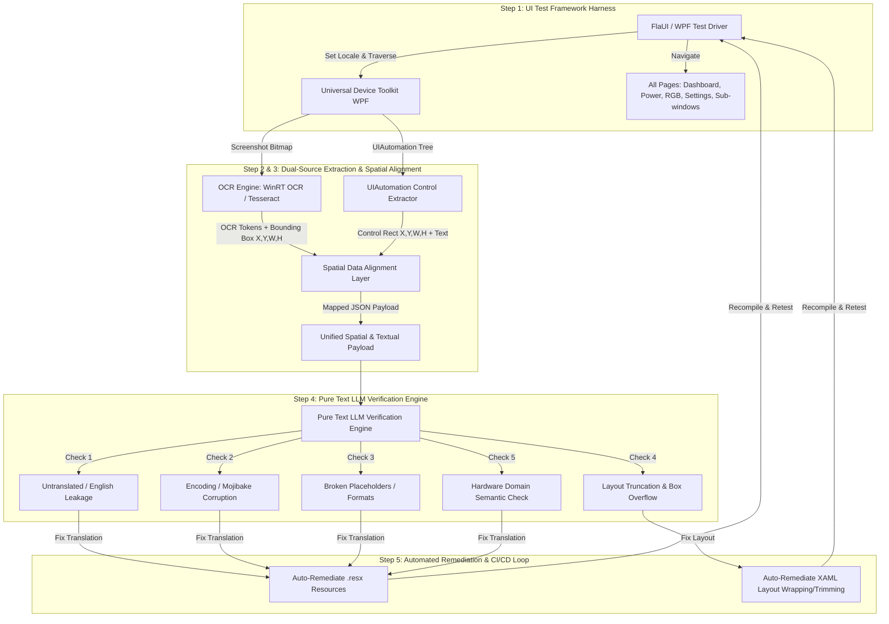

# Master Engineering Plan: Localization, OCR Verification, Performance Governance, Code Standards & Open Source Promotion

This document establishes the comprehensive engineering, localization, performance, code-style, and open-source marketing governance plan for Universal Device Toolkit (`UniversalDeviceToolkit.WPF`, `UniversalDeviceToolkit.Lib`, and related components). It combines our **Automated OCR & Pure Text LLM Translation Verification Architecture** with **Strict Engineering Behavioral Constraints** and **Open-Source Promotion Guidelines**, ensuring that every aspect—from code syntax and thread safety to user-facing copy and global marketing—is rigorously controlled.

---

## 1. Architectural & Behavioral Governance (核心架构与行为强约束)

To permanently prevent regressions of previously resolved performance bottlenecks, RDP freezes, and UI crashes, all code additions and modifications across Universal Device Toolkit MUST adhere to the following mandatory architectural constraints:

### A. WPF UI Thread Affinity & Dispatcher Safety (UI 线程安全强约束)
- **Zero `.ConfigureAwait(false)` in UI-Bound Code**: In WPF applications, calling `.ConfigureAwait(false)` on asynchronous tasks originating from UI event handlers, ViewModels, or control lifecycle methods strips the `SynchronizationContext`, forcing continuations onto background thread-pool threads. Any subsequent access to WPF `DependencyProperty` values or visual trees throws an `InvalidOperationException`. **Rule: Never use `.ConfigureAwait(false)` in WPF UI, ViewModel, or UI helper code.**
- **Defensive Dispatcher Guards**: All event handlers subscribed to background services (e.g., `AutomationProcessor.PipelinesChanged`, `PluginRepositoryService.DownloadProgressChanged`, `LanguagePackManager`, or hardware sensor timers) MUST explicitly guard UI updates using `Dispatcher.CheckAccess()` and `Dispatcher.InvokeAsync()`.
- **Background Task Teardown**: Long-running async streams and process redirections (e.g., `CMD.cs`, CLI wrappers) must cleanly handle cancellation tokens and kill child processes to avoid orphan locks or `NullReferenceException` during teardown.

### B. WMI Deadlock & Timeout Protection (WMI 与远程桌面防卡死约束)
- **No Synchronous WMI Queries**: Synchronous WMI calls (`ManagementObjectSearcher.Get()`, `ManagementObject.InvokeMethod()`) can enter tight kernel ACPI spinloops under Remote Desktop (RDP) sessions or virtual display drivers, causing 30-second UI freezes. **Rule: All WMI queries MUST use asynchronous extensions (`GetAsync()`, `CallInternalAsync`) wrapped in strict 2,500ms–3,000ms timeouts.**
- **No Synchronous WMI Event Watchers**: Avoid synchronous `ManagementEventWatcher.Start()` on the UI thread (such as in system theme monitoring). Use Win32 P/Invoke (`RegNotifyChangeKeyValue`) or background thread polling.

### C. Zero-Spam Polling & I/O Efficiency (高频监控零冗余 I/O 约束)
- **No Per-Poll Disk Logging or String Serialization**: In high-frequency polling loops (sensors, GPU monitoring, network traffic, running at 500ms–2000ms intervals), **never** serialize full JSON data structs or emit diagnostic trace logs on every tick (`SensorsController`, `AbstractSensorsController`, `GPUController`). Log only upon state transitions, initialization, or actual errors.
- **Error Throttling & Cooldowns**: Hardware performance counters (`SafePerformanceCounter`) and WMI queries must implement error cooldown timers (e.g., 30-second retry intervals) if a counter is corrupted or missing, preventing endless exception-throwing loops.

---

## 2. Code-Level String & Localization Governance (代码文案与本地化强约束)

With 78+ supported languages across the project, UI text written directly in code or markup must follow strict localization rules:

### A. Eradication of Hardcoded Strings (杜绝代码与 XAML 硬编码文案)
- **No Hardcoded UI Text**: It is strictly forbidden to write hardcoded user-facing text (English or Chinese) directly in C# code-behind, ViewModels, dialog prompts, tooltips, or XAML markup.
- **Mandatory Resource Referencing**: All user-facing strings MUST be defined in `Resource.resx` (and translated across satellite `.resx` files) and referenced via strongly-typed resource properties (e.g., `Resource.DashboardPage_ThermalMode_ToolTip` in C#, or `{x:Static res:Resource.DashboardPage_ThermalMode_ToolTip}` in XAML).
- **Descriptive & Namespaced Key Naming**: Resource keys must follow a clear namespace hierarchy: `<Area>_<Component>_<Property/Purpose>` (e.g., `SettingsPage_AutoUpdate_Header`, `TrayMenu_GodMode_Label`, `Dialog_ConfirmUninstall_Message`).

### B. String Interpolation & Grammar Formatting (动态文本格式化规范)
- **No String Concatenation for Localized Text**: Never construct sentences using string concatenation (`"Speed: " + speed + " RPM"` or `$"Speed: {speed} RPM"` with hardcoded prefixes). In RTL (Arabic/Hebrew) and SOV (Japanese/Korean) languages, grammatical word order differs entirely from English.
- **Positional & Named Formatting**: Use parameterized resource strings with numbered placeholders (e.g., in `.resx`: `"Speed: {0} RPM"`, translated in Japanese to `"{0} RPM の速度"`), invoked via `string.Format(CultureInfo.CurrentCulture, Resource.FanSpeed_Format, speed)`.
- **Locale-Aware Number & Date Formatting**: Always pass `CultureInfo.CurrentCulture` or `CultureInfo.CurrentUICulture` when formatting floating-point numbers, currencies, percentages, and timestamps (e.g., respecting `,` vs `.` decimal separators in German/French).

---

## 3. Code Style, Commenting & Engineering Standards (代码风格、注释与细节规范)

To maintain a pristine, state-of-the-art codebase that is easily readable and maintainable by both human engineers and AI agents:

### A. Commenting & Documentation Integrity (注释与文档规范)
- **Preserve Existing Comments**: Never delete or alter existing comments, docstrings, or copyright headers unless the underlying code logic is explicitly removed or changed.
- **Professional XML Docstrings**: All public classes, interfaces, methods, and complex helper functions must include clear C# XML documentation comments (`/// 
`, `/// <param>`, `/// <returns>`).
- **"Why" Over "What" Inline Comments**: When writing non-obvious code (such as UI Dispatcher checks, WMI thread-pool wrappers, or timeout guards), add concise inline comments explaining *why* the guard exists (e.g., `// Guard against cross-thread UI access when triggered by background HttpClient download callbacks`).
- **No Commented-Out Dead Code**: Do not leave commented-out legacy code blocks or TODO clutter in production files.

### B. Modern C# & .NET 10 Coding Style (现代 C# 代码风格)
- **Primary Constructors**: Leverage C# 12+ primary constructors for classes and structs with dependency injection or simple parameter initialization (e.g., `public sealed class TrayHelper(LanguagePackManager languagePackManager)`).
- **File-Scoped Namespaces**: Always use file-scoped namespaces (`namespace UniversalDeviceToolkit.WPF.Utils;`) to reduce indentation nesting.
- **Strict Nullability Discipline**: Keep `#nullable enable` active across all files. Explicitly check for nulls using pattern matching (`is not null`, `is null`) or null-conditional operators (`?.`), avoiding `NullReferenceException`.
- **Allocation Discipline**: Avoid unnecessary heap allocations in frequent paths. Use collection expressions (`[]`), `Array.Empty<T>()`, and static lambdas where capturing is unneeded.
- **Naming Conventions**:
  - Private fields: `_camelCase` (e.g., `_activeTask`, `_sync`).
  - Properties, Methods, Events, Public Fields: `PascalCase` (e.g., `InstallAsync`, `IsActive`).
  - Asynchronous Methods: Must append `Async` suffix (e.g., `UpdateStatusItemsAsync`).
  - Constants & Static Readonly: `PascalCase` or `UPPER_SNAKE_CASE` for pure const tokens (e.g., `NAVIGATION_TAG`).

---

## 4. Open Source Promotion & Marketing Governance (开源项目宣传推广与文案规范)

As an open-source project, effective community outreach, user acquisition, and transparent communication are vital. All promotion strategies, community posts, release notes, and marketing copy MUST comply with the following structured guidelines and ethical constraints:

### A. Key Promotion Channels (核心宣传渠道与阵地)
1. **Global Developer & Hardware Communities**:
   - **GitHub**: Releases, Discussions, Topics (`windows-10`, `windows-11`, `wpf`, `lenovo-legion`, `hardware-monitor`, `overclocking`, `open-source`), and README badges.
   - **Reddit**: Subreddits including `r/LenovoLegion`, `r/GamingLaptops`, `r/hardware`, `r/windows`, `r/opensource`, and `r/Csharp`.
   - **Tech Forums & News**: Hacker News, Linus Tech Tips Forum, Tom's Hardware Forum, X (Twitter), Discord server announcements.
2. **Chinese Tech & Geek Communities (国内核心科技与极客社区)**:
   - **硬核测评与发烧友论坛**：吾爱破解 (52Poje)、V2EX、Chiphell (CHH)、S1论坛、超能网。
   - **内容平台与专栏**：B站 (Bilibili 专栏与专区硬件测评/开源推荐视频)、知乎 (知乎专栏/硬件与笔记本调优问答)、小红书 (电脑硬件调优/极客软件推荐)。
   - **贴吧与社群**：百度贴吧 (联想拯救者吧、笔记本吧、显卡吧、极客吧)、QQ讨论群、微信开发者与硬件社群。

### B. Core Elements of Promotional Copywriting (宣传文案黄金要素)
Every promotional post, release article, or community introduction should be structured around four core pillars:
1. **The Hook / Pain Point (痛点切入)**: Highlight the frustrations of bulky OEM management suites (e.g., Lenovo Vantage, Armoury Crate, Synapse, iCUE)—such as 500MB+ background memory consumption, CPU usage spikes, invasive background telemetry, slow startup times, and cluttered UI.
2. **The Solution & Value Proposition (核心优势与轻量化价值)**: Introduce Universal Device Toolkit as the ultimate lightweight, native alternative:
   - **100% Native C# / .NET 10 WPF**: Built for speed and responsiveness.
   - **Ultra-Low Resource Footprint**: Consumes `<30MB` of RAM in the background with zero CPU spam or disk I/O churn.
   - **Instant Startup**: Launches in under 1 second without background background service bloat.
   - **Zero Telemetry & Ad-Free**: Total privacy and transparency.
3. **Feature Highlights (硬核亮眼功能展示)**:
   - Advanced Custom Fan Curves & Real-time Hardware Monitoring.
   - GPU Overclocking, MUX Switch (DGPU/IGPU/Hybrid) control, and Power Mode automation.
   - Spectrum RGB Keyboard backlighting & Custom Macro engine.
   - GodMode advanced system tweaks & Windows OS Optimization tools.
   - **Global Accessibility**: Native support for **78+ languages** with dynamic online language packs!
4. **Call to Action & Open Source Trust (行动号召与开源信任)**:
   - Provide direct links to the GitHub Repository and Latest Release download.
   - Emphasize the open-source MIT License.
   - Invite users to star the repo, report issues, submit PRs, and contribute to localization/translations.

### C. Mandatory Copywriting Constraints & Ethical Boundaries (文案强约束与底线规范)
To maintain project credibility and respect within the developer and hardware community, all promotional copy MUST strictly abide by these rules:
1. **Truthful & Evidence-Based (严守事实，绝不虚假夸大)**:
   - **Never** make baseless or exaggerated marketing claims (e.g., do NOT claim "Doubles your gaming FPS" or "Zero memory usage").
   - Use objective, measurable data (e.g., *"Reduces background memory usage by up to 90% compared to standard OEM management suites"* or *"Zero background trace log disk spam"*).
2. **Objective & Respectful Towards OEMs (尊重厂商，严禁拉踩诋毁)**:
   - When comparing Universal Device Toolkit with official OEM suites (like Lenovo Vantage), maintain a professional, technical, and respectful tone.
   - Position the toolkit as an *"advanced, lightweight community alternative designed for power users and enthusiasts"* rather than using defamatory, aggressive, or toxic language against OEM software.
3. **Clear Compatibility & Safety Disclosure (清晰标注兼容性与安全声明)**:
   - Explicitly list supported hardware (e.g., Lenovo Legion, Yoga, LOQ series, alongside universal Windows 10/11 system optimization features).
   - Clearly state that hardware tweaks (like BIOS setting overrides or GPU overclocking) carry inherent hardware limits, providing clear instructions and disclaimers so users feel safe and informed.
4. **Security & Privacy Commitment (隐私与安全绝对承诺)**:
   - explicitly highlight that the code is 100% open-source, auditable, contains zero spyware, zero tracking, zero background analytics, and zero bundled adware.

---

## 5. Pure Text Model OCR Translation Verification Architecture

To verify visual UI translation correctness (truncation, layout overflow, missing translations, mojibake) without relying on multimodal vision models, we implement a **Dual-Source Spatial Text Alignment Pipeline** powered by a **Pure Text LLM** + **OCR** + **UIAutomation**.

### The 5-Dimension Verification Rules (纯文本大模型五维质检规则)
When feeding the combined OCR bounding box + UIAutomation control tree JSON into the Pure Text LLM, the model evaluates 5 deterministic rules:

| Verification Dimension | Detection Logic (Pure Text Model Rules) | Example Defect Detected |
| :--- | :--- | :--- |
| **1. Untranslated / Fallback Detection (漏译与英文残留)** | Compare `uia_text` and `ocr_matches.text` against known English default strings. If English text appears in a non-English locale (excluding brand names like "Lenovo" or "GPU"), flag as untranslated. | Locale: `ja-JP` Text: `"Enable Quiet Mode"` (Should be `"静音モードを有効にする"`) |
| **2. Encoding / Mojibake Corruption (乱码与字符集破损)** | Scan text tokens for Unicode replacement characters (``), question mark clusters (`???`), consecutive box symbols (`□□`), or invalid UTF-8 multibyte sequences. | Locale: `zh-Hans` Text: `""` or `"? ? ? ?"` |
| **3. Broken Placeholders / Formats (占位符与格式化失效)** | Check for un-interpolated C# format specifiers (`{0}`, `{1}`, `{voltage:F2}`), raw binding tags (`{Binding ...}`), or `NaN` / `Null` literal strings in UI controls. | Text: `"Current Temp: {0}°C"` or `"Speed: NaN RPM"` |
| **4. Layout Truncation & Box Overflow (布局截断与越界检测)** | Analyze `spatial_analysis`: if `ocr_matches.text` ends with ellipses (`...`, `…`), or if `ocr_bounds.width >= control_bounds.width * 0.98`, or if OCR text coordinate boundaries extend outside the parent button/border bounds, flag as layout truncation or overflow! | Button Width: `140px` OCR Text Width: `138px` OCR Text: `"Wärmemodus akt..."` (Truncated!) |
| **5. Technical Domain Semantics (专业硬件语义校对)** | Verify that translated terms match established PC hardware and overclocking domain terminology (e.g., distinguishing "Fan Curve", "MUX Switch", "Overdrive", "Power Plan"). | Locale: `zh-Hans` Text: `"风扇弯曲"` (Literal mistranslation of "Fan Curve", should be `"风扇曲线"`) |

---

## 6. Implementation & Remediation Workflow

### Step 1: Codebase Governance Audit & String Extraction
- Execute an exhaustive grep/search across `UniversalDeviceToolkit.WPF` and `UniversalDeviceToolkit.Lib` to locate any remaining hardcoded strings, string concatenations, or missing docstrings.
- Extract all identified strings into `Resource.resx`, standardizing key names and parameter formatting.

### Step 2: Automated UI Verification Harness Setup
- Implement a lightweight automated test script using **FlaUI** + **Windows WinRT OCR** (native offline OCR built into Windows 10/11).
- Configure the test harness to iterate across priority locales (`zh-Hans`, `zh-Hant`, `de`, `es`, `ja`, `fr`, `ru`), taking screenshots and dumping UIAutomation control coordinates.

### Step 3: Automated Remediation & CI/CD Execution
- Run the Pure Text LLM verification engine against the extracted JSON payloads.
- Autonomously apply fixes:
  - **Text/Translation Fixes**: Update `.resx` files for missing translations or semantic errors.
  - **Layout Fixes**: Update `.xaml` files with dynamic sizing (`MinWidth`, `Grid` star sizing) and wrapping (`TextWrapping="Wrap"`, `TextTrimming="CharacterEllipsis"`) where OCR bounding boxes detect text truncation.
- Recompile the solution (`dotnet build -c Debug`) and re-run automated verification until 0 defects remain.

---

## 7. User Review Required

> [!IMPORTANT]
> **Strict Engineering Standards Enforcement**: This plan elevates our previous bug fixes (UI Dispatcher guards, WMI async timeouts, zero-spam polling) and code styling rules (no hardcoded strings, XML docstring integrity, modern C# 12 syntax) into **Mandatory Engineering Constraints** for all current and future work.

> [!TIP]
> **Automated XAML & Resx Modifications**: When the verification pipeline runs, it will autonomously propose and apply fixes to `.resx` translation files and XAML layout formatting (such as changing fixed widths to `MinWidth` or enabling text wrapping). Please confirm if you approve enabling autonomous remediation during verification runs.

---

## 8. Open Questions

1. **Target Locale Prioritization**: Out of the 78+ supported languages, are there specific priority locales (e.g., `zh-Hans`, `zh-Hant`, `de`, `es`, `ja`, `fr`, `ru`) that we should benchmark first during the initial UI automation run?
2. **OCR Engine Preference**: Do you prefer using Windows native offline **WinRT OCR** (zero setup, ultra-fast), or should we integrate an external OCR provider/library (e.g., Tesseract / PaddleOCR)?
3. **Style Enforcement Tooling**: Should we also configure an `.editorconfig` or custom Roslyn Analyzer rule set to automatically flag hardcoded strings or `.ConfigureAwait(false)` in WPF during MSBuild compile time?
