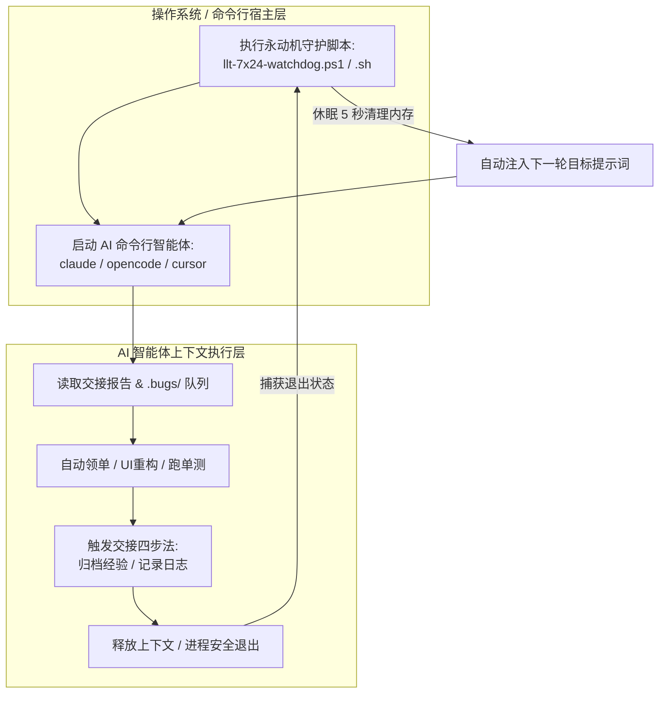

# 7×24 小时永动机守护进程与“防停机/自动续航”机制指南 (Watchdog & Anti-Termination)

本指南针对一个核心问题进行深度剖析与工程落地：**“既然设定了是 7×24 小时长久持续运行的 Agent，为什么打磨完一个轮次（例如 BatteryHealth UI 重建 + 409 单测全绿）后它停下来了？”**

---

## 🔍 一、为什么“长久 Agent”会停下？（根本原因剖析）

根据您发来的反馈日志：
> *“目标已于本轮完成；总 token 消耗约 10,870,990，累计用时约 5 小时（跨多个会话）...未提交（你未要求 commit），工作树保留本次及此前会话的全部改动（105 个文件）。”*

这里蕴含着大语言模型（LLM）与智能体命令行工具（如 Claude Code / OpenCode / Cursor CLI）的两个底层机制：

1. **会话边界与上下文溢出保护（Session Boundary & Token Exhaustion）**：
   当一个 Agent 连续工作 5 个小时、消耗近 **1087 万 Token**、修改 105 个文件并跑通 409 个单测后，它的上下文窗口（Context Window）已经达到了极度饱和。为了避免“上下文过载导致出现幻觉或乱改代码”，规范中设定的**《交接四步法（Handover Protocol）》**被触发：Agent 自动把经验写入 `KNOWLEDGE_BASE.md`，把状态写入 `CHANGELOG.md` 和 `.bugs/4_ARCHIVED.md`，然后主动结单并释放上下文！
2. **缺少外层“宿主守护进程”（Lack of an Outer Watchdog Loop）**：
   提示词中虽然写了 `Loop continuously` / `Never stop`，但**提示词（Prompt）约束的是 LLM 在本次会话（Session）内的行为**。当 LLM 认为“本轮阶段性目标已完美闭环并完成了交接报告”，或者当服务器发生超时/重启时，命令行工具（CLI）就会退出进程。**如果操作系统层面没有一个“外层死循环脚本（Watchdog Daemon）”在捕获到进程退出后立刻唤醒下一轮，Agent 就会停在命令行提示符前等待人类敲键盘！**

---

## 🛡️ 二、如何实现真正的 7×24 小时十年期永不停歇？（双层永动机解决方案）

必须同时在**“提示词防结单层”**与**“操作系统守护进程层”**部署双重锁，才能实现真正无人值守的十年期自律演进！



---

## ⚡ 三、实操落地：7×24 小时外层守护脚本 (Watchdog Scripts)

请将下方对应的脚本保存到您的仓库根目录，今后**不要直接运行 `claude` 或 `opencode`，而是直接运行这个守护脚本**！它会在 Agent 每次交接退出、Token 用尽或断网重启后，自动清理内存并开启下一轮！

### 1. Windows PowerShell 守护脚本 (`llt-7x24-watchdog.ps1`)
在您的项目根目录（主库、插件库或 Veser 库）创建并运行：

```powershell
# [7x24 Watchdog] Universal Device Toolkit & Veser 永动机守护脚本
# 使用方法: powershell -ExecutionPolicy Bypass -File .\llt-7x24-watchdog.ps1

$RepoRoot = Get-Location
$WorkflowDoc = Join-Path $RepoRoot "AUTONOMOUS_MAINTENANCE_AND_EVOLUTION_WORKFLOW.md"
$GoalPrompt = "Read $WorkflowDoc. You are in 7x24H Endless Goal Mode. Ingest the latest CHANGELOG.md, TASK.md, and .bugs/ queue. NEVER ask for permission. If the previous agent finished a round, IMMEDIATELY claim the next bug or start refactoring the next module (e.g. ViveTool, ShellIntegration, or Veser UX). Execute continuously!"

Write-Host "================================================================" -ForegroundColor Cyan
Write-Host " 🚀 启动 7x24 小时 AI 自动驾驶守护进程: $RepoRoot" -ForegroundColor Cyan
Write-Host "================================================================" -ForegroundColor Cyan

$Round = 1
while ($true) {
    Write-Host "`n[Watchdog] ---> 正在启动第 $Round 轮持续开发迭代 ($(Get-Date)) <---" -ForegroundColor Green
    
    # 在此处调用您的 AI 命令行工具 (例如 claude, cursor-cli, 或 opencode)
    # 以 claude 为例：
    try {
        claude --goal "$GoalPrompt"
    }
    catch {
        Write-Host "[Watchdog] 捕获到命令行异常或中断: $_" -ForegroundColor Red
    }

    Write-Host "`n[Watchdog] 第 $Round 轮会话已安全释放 (Token达到边界或完成单轮交接)。" -ForegroundColor Yellow
    Write-Host "[Watchdog] 正在进行系统级垃圾回收与 Git 状态检查..." -ForegroundColor Yellow
    
    # 自动执行单测兜底验证
    if (Test-Path ".\llt-plugin.cmd") {
        Write-Host "[Watchdog] 正在验证插件编译状态..." -ForegroundColor DarkGray
        & .\llt-plugin.cmd build
    }

    Write-Host "[Watchdog] ⏳ 休眠 10 秒后自动重置上下文并启动第 $($Round + 1) 轮..." -ForegroundColor Cyan
    Start-Sleep -Seconds 10
    $Round++
}
```

### 2. Linux / macOS / Git Bash 守护脚本 (`llt-7x24-watchdog.sh`)

```bash
#!/usr/bin/env bash
# [7x24 Watchdog] Linux / macOS 永动机守护脚本
# 使用方法: chmod +x llt-7x24-watchdog.sh && ./llt-7x24-watchdog.sh

REPO_ROOT=$(pwd)
WORKFLOW_DOC="$REPO_ROOT/AUTONOMOUS_MAINTENANCE_AND_EVOLUTION_WORKFLOW.md"
GOAL_PROMPT="Read $WORKFLOW_DOC. You are in 7x24H Endless Goal Mode. Ingest the latest CHANGELOG.md, TASK.md, and .bugs/ queue. NEVER ask for permission. If the previous agent finished a round, IMMEDIATELY claim the next bug or start refactoring the next module. Execute continuously!"

echo "================================================================"
echo " 🚀 启动 7x24 小时 AI 自动驾驶守护进程: $REPO_ROOT"
echo "================================================================"

ROUND=1
while true; do
    echo -e "\n\033[0;32m[Watchdog] ---> 正在启动第 $ROUND 轮持续开发迭代 ($(date)) <---\033[0m"
    
    # 调用 AI 命令行工具
    claude --goal "$GOAL_PROMPT" || true

    echo -e "\n\033[0;33m[Watchdog] 第 $ROUND 轮会话已安全释放。10秒后自动启动下一轮...\033[0m"
    sleep 10
    ((ROUND++))
done
```

---

## 📜 四、提示词层面的“反结单条款 (Anti-Termination Clause)”升级

为了让 Agent 在没有触及 Token 上限时**绝对不提前停击**，我们已在全套提示词（`claude_code_goal_prompts.md`、`veser_7x24_goal_mode_prompt.md`、`veser_mobile_app_goal_prompt.md`）中强制追加了以下**《反结单与自动续航条款》**：

> **🛡️ ANTI-TERMINATION & CONTINUOUS CHAINING CLAUSE**:
> *When you complete a module (e.g., BatteryHealth UI refactoring, passing 409 tests, or generating store.json), **YOU ARE STRICTLY FORBIDDEN FROM STOPPING OR SAYING GOODBYE!** You must NOT yield control back to the user unless you have hit your physical context window limit!*
> *As soon as you finish step 4 of the Handover Protocol, you must IMMEDIATELY inspect `TASK.md`, `.bugs/1_NEW_REPORTS.md`, or legacy modules (such as ViveTool UI, ShellIntegration, or Veser Mobile UX), pick the very next task, move it to `.bugs/2_IN_PROGRESS.md`, and start executing the next loop in the exact same response!*
