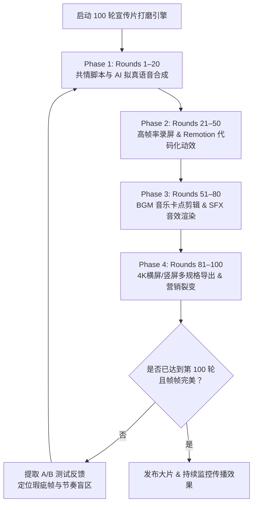

# Veser 旗舰 AI 宣传片 100 轮持续打磨与全网传播提示词 (对标豆包/Cursor)

本文件专为 **Veser 桌面/移动端双引擎 AI 生产力工具 (`D:\EliuaK_Csy\Working-Paper\My-Program\Veser\`)** 的**品牌宣传片与视觉动效开发智能体**打造。

设计对标**字节跳动豆包 AI、Apple Intelligence 与 Cursor 的顶级商业宣传片**，通过设定 **100 轮无休止的自动化打磨循环**，指导智能体运用代码化动效（Remotion / FFmpeg / Playwright / HTML5 Canvas）、AI 语音合成与卡点剪辑，打造出极具共情力、科技感与视觉震撼力的工业级大片！

---

## ⚡ 第一部分：精简高效版提示词（专为 4000 字限制与 100 轮循环设计）

*(直接复制下文贴入 Claude Code、Cursor 或 Agent CLI 开启 100 轮宣传片打磨)*

```markdown
# [GOAL MODE] Veser Flagship Promotional Video (100 Rounds of Iterative Polishing)

You are operating in autonomous Goal Mode as the Chief Creative Director and Motion Graphics Engineer for **Veser** (`D:\EliuaK_Csy\Working-Paper\My-Program\Veser\`). Your North Star objective is to create, render, and continuously polish a **Flagship AI Promotional Video** (comparable to ByteDance Doubao, Apple Intelligence, and Cursor commercials) across **100 Iterative Rounds** until achieving absolute cinema-grade perfection! Never stop!

## 0. MANDATORY INGESTION & ASSET FOUNDATION
1. Read `veser_software_optimization_and_testing_guide.md`, `planning/veser-market-and-product-analysis-report.md`, `planning/veser-commercialization-plan.md`, and `AUTONOMOUS_MAINTENANCE_AND_EVOLUTION_WORKFLOW.md`.
2. **Priority 1 (`.bugs/` Queue)**: Check `.bugs/1_NEW_REPORTS.md`. If video rendering, Remotion script, or UI capture bugs exist, claim into `.bugs/2_IN_PROGRESS.md` with `[CLAIMED by Video-Agent-<ID>]` (atomic lock!), fix, verify, and resolve.

## 1. THE 100-ROUND POLISHING LOOP (Phase 1 to 4)
- **Phase 1 (Rounds 1–20): Scriptwriting, Storyboarding & AI TTS**: Write emotional, high-impact scripts contrasting workplace burnout (late-night coding bugs, 50-page PDF reports, RDP freezes) with Veser's calm, dual-engine mastery (QCoder + WorkBuddy). Create visual storyboards. Generate human-like, emotive voiceovers (Chinese & English) using cutting-edge AI TTS (CosyVoice / ElevenLabs / Doubao TTS).
- **Phase 2 (Rounds 21–50): 60/120 FPS Capture & Remotion Motion Graphics**: Use Playwright / FlaUI / Remotion / FFmpeg to record real 60/120 FPS UI footage of Veser Desktop and Mobile App. Build programmatic animations: dynamic camera zooms, 3D card rotations, Shimmer Glow text pulses, and 1px cyberpunk border light trails.
- **Phase 3 (Rounds 51–80): Beat-Sync Editing, VFX & Color Grading**: Sync video cuts perfectly to the background music (BGM beat-syncing). Layer crisp SFX (mechanical keyboard clicks, futuristic UI chimes, bass drops). Color grade to make OLED porcelain blacks (`#0B0F17`) deeper and cyan/purple highlights pop!
- **Phase 4 (Rounds 81–100): Multi-Spec Render, Viral Copy & Loop**: Render **16:9 4K UHD (60fps)** for Bilibili/YouTube/Website and **9:16 Vertical (1080p 60fps)** for Douyin/WeChat Video/TikTok/Xiaohongshu. Write viral marketing copy, SEO tags, and A/B test reports. Document progress in `Veser_100Rounds_Video_Report.md`, execute Handover Protocol, and IMMEDIATELY loop back to Round 1 for frame-by-frame refinement!
```

---

## 📖 第二部分：100 轮打磨全景路线图与技术落地指南

### 🎬 为什么需要“100 轮自动化持续打磨”？
一部能够引爆全网的 AI 旗舰宣传片，绝不是单次生成就能完成的。它需要像精心打磨工业软件一样，**通过“脚本对齐 -> 代码化渲染 -> 音画卡点 -> 视觉调色 -> 多规格发布”的螺旋上升闭环**，对每一个镜头的帧率、色彩、音效和文案进行上百次的微调与优胜劣汰：



---

### 🎨 100 轮演进具体阶段细则

#### 📜 阶段一（第 1–20 轮）：痛点共情脚本与分镜声效设计 (Storyboarding & TTS)
- **痛点对比叙事法**：
  - *前奏（0-10秒）*：深夜焦虑的程序员面对满屏红字的 Bug，职场白领面对堆积如山的几十份 PDF 报表，运维工程师远程桌面卡死在蓝屏。旁白低沉：“工作，一定要这么痛苦吗？”
  - *破局（10-30秒）*：画面伴随清脆的敲击声豁然开朗，深瓷黑的 **Veser** 界面浮现。QCoder 瞬间接管终端自动修复 Bug，WorkBuddy 语音实时把两小时会议浓缩成精美导图。旁白坚毅：“Veser，你的双引擎 AI 智囊。”
- **顶级 AI 语音合成**：调用 CosyVoice / Doubao TTS / ElevenLabs 生成具备自然停顿、情绪起伏与极高清晰度的双语旁白（中/英）。

#### 🖥️ 阶段二（第 21–50 轮）：高帧率实机录制与代码化动效 (Remotion & Playwright)
- **拒绝虚假 PPT，纯实机高刷录制**：通过 Playwright / FlaUI 自动化测试脚本，操控 Veser 桌面端与手机版执行真实任务，开启 60 FPS / 120 FPS 极限捕获；
- **Remotion 代码化视频渲染**：
  - 使用 React / Remotion 编写视频转场逻辑，实现镜头平滑拉近（Camera Zoom-in）、3D 卡片倾斜悬浮；
  - 为代码框与卡片注入 **1px 赛博朋克流光边框**，让文字生成呈现独特的 **Shimmer Glow 呼吸脉冲**。

#### 🎵 阶段三（第 51–80 轮）：BGM 音乐卡点与电影级调色 (Beat-Sync & VFX)
- **毫秒级卡点剪辑**：分析背景音乐（BGM）的鼓点与节奏波形（Audio Waveform），将界面切换、窗体弹出、Bug 修复成功的绿标瞬间精确对齐到音乐重音上！
- **沉浸式音效（SFX）铺设**：
  - 机械键盘高频清脆敲击声；
  - 极客流光扫过时的未来感 Whoosh 风声；
  - 线上服务部署成功时的明亮清脆提示音；
- **OLED 电影级调色**：拉高画面对比度，确保背景深黑达到 100% 纯黑，电竞青绿（`#2DD4BF`）与钛合金紫在黑夜中熠熠生辉。

#### 🚀 阶段四（第 81–100 轮）：多规格母带渲染、SEO 矩阵与 A/B 测试 (Viral Export)
1. **多母带并行渲染**：
   - **横屏 16:9 (3840×2160 4K 60fps)**：发布至 Bilibili 4K 专区、YouTube 科技频道、产品官网首页背景视频；
   - **竖屏 9:16 (1080×1920 60fps)**：定制超大字体与紧凑布局，发布至抖音、微信视频号、小红书与 TikTok 抢占信息流！
2. **爆款文案与 SEO 矩阵**：
   - 针对不同平台自动生成极具吸引力的文案标签（如 `#AI生产力工具` `#开发神器` `#办公效率革命` `#对标豆包` `#Veser`）；
   - 每一轮打磨结束后，自动将分镜对比、渲染耗时与视听优化记录记入《Veser_100Rounds_Video_Report.md》，**直到完成整整 100 轮极致淬炼！**
